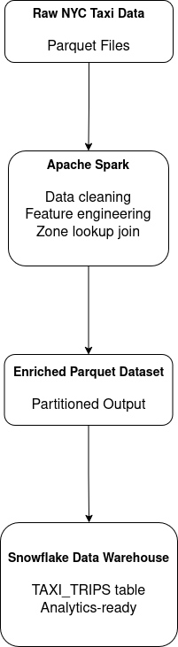
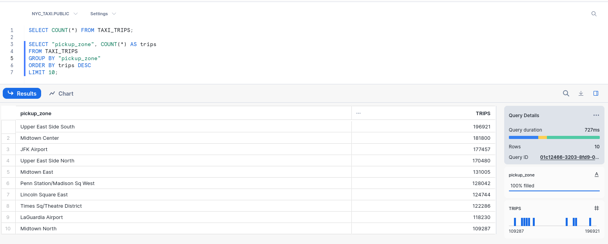

# NYC Taxi ETL Pipeline (Spark → Parquet → Snowflake)

## Overview

This project is an **end-to-end data engineering pipeline** built on the NYC Taxi dataset.
It demonstrates how to ingest raw Parquet data, perform transformations and dimensional joins using **Apache Spark**, and load the enriched data into **Snowflake** for analytics.

The pipeline is designed to reflect **real-world DE workflows**, including environment-based configuration, schema management, and cloud data warehouse loading.

## Architecture



## Technologies Used

* Python 3.10
* Apache Spark (PySpark)
* Parquet
* Snowflake
* Pandas / PyArrow
* python-dotenv
* Git / GitHub

## Data Set

* NYC Taxi Trip Data (Parquet format)
* Joined with Taxi Zone Lookup to add pickup and dropoff zone names

## Project Structure
```
nyc-taxi-etl/
│
├── src/
│   └── nyc_taxi_pipeline_to_snowflake.py
│
├── data/
│   ├── raw/              # Raw NYC taxi parquet files
│   └── processed/        # Enriched parquet output
│
├── .env.example
├── .gitignore
├── requirements.txt
└── README.md
```

## Pipeline Steps 

1. Read raw Parquet data using Spark
2. Clean and transform data
    * Remove invalid records
    * Cast data types
    * Compute trip duration  
3. Join taxi zone lookup table
    * Add pickup and dropoff zone names
4. Write enriched data to Parquet
5. Load final dataset into Snowflake
    * Uses secure environment variables
    * Creates table if needed
  
## Environment Setup 

1. **Clone the repository**
```
git clone https://github.com/arehart95/nyc-taxi-etl.git
cd nyc-taxi-etl
```

2. **Create a virtual environment**
```
python3.10 -m venv venv
source venv/bin/activate
pip install -r requirements.txt
```

3. **Configure environment variables**

Copy the example file
```
cp .env.example .env
```
And fill in your snowflake credentials in `.env`
```
SNOWFLAKE_USER=your_username
SNOWFLAKE_PASSWORD=your_password
SNOWFLAKE_ACCOUNT=account_locator.region.cloud
SNOWFLAKE_WAREHOUSE=COMPUTE_WH
SNOWFLAKE_DATABASE=NYC_TAXI
SNOWFLAKE_SCHEMA=PUBLIC
```
## Running the pipeline 

From the project root
```
python src/nyc_taxi_pipeline_to_snowflake.py
```
A successful execution will write enriched Parquet data locally and load the data into Snowflake

## Querying the data in Snowflake 

Example queries




## Example insights

* Busiest pickup zones by trip volume
* Peak taxi usage hours
* Average trip duration by zone
* Distribution of fares and distances

## Future improvements

* Add data quality checks
* Partition Parquet outputs
* Add incremental loads
* Orchestrate with Airflow or Prefect
* Add BI Dashboard

## Why this project

This project was built to practice:
* Spark-based ETL
* Working with columnar data formats
* Dimensional joins
* Loading data into a cloud data warehouse
* Secure configuration management

## Author

Quentin Arehart  
GitHub: https://github.com/arehart95


